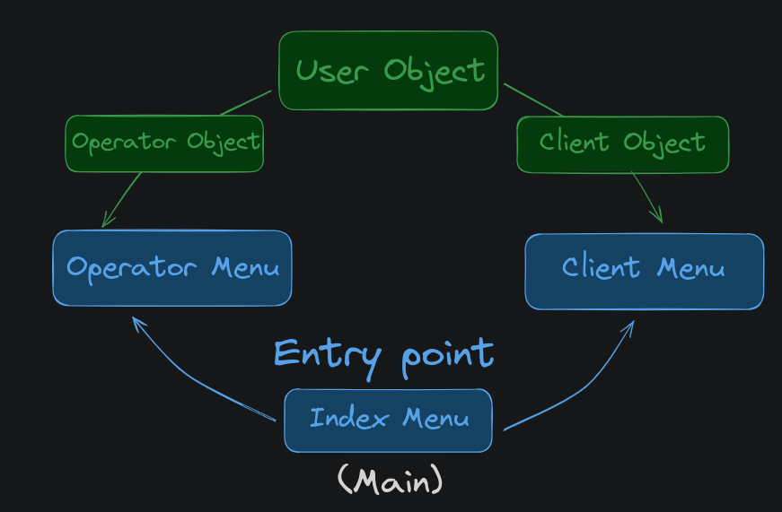

# Bank Project

## Description

This project is a simple **bank application** that allows users to create   accounts, deposit and withdraw money, and view their account balance.
It will also have an **Operator panel** that allows the operator to view all accounts and their balances, transactions, and other information.

The aim is to establish the knowledge of the following concepts:

* Object Oriented Programming
  * Inheritance
  * Abstract Classes
  * Encapsulation

 

